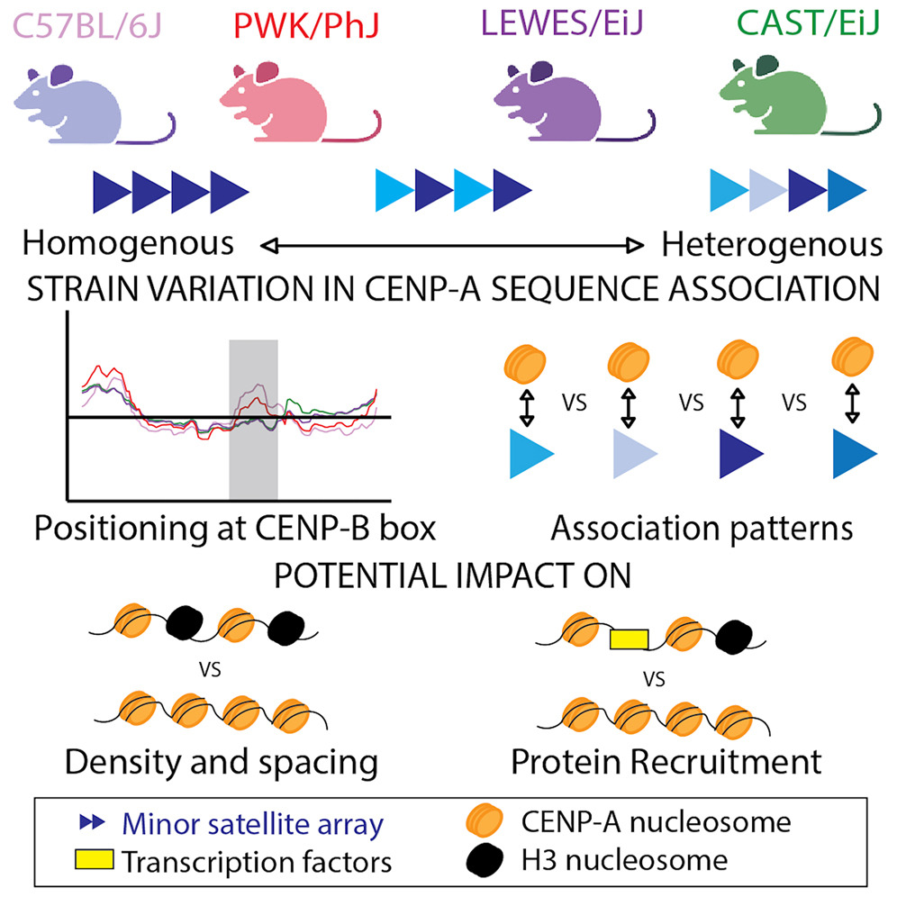

# Strain level centromere variation influences CENP-A association dynamics and centromere function
[Arora et. al (2023)](https://doi.org/10.1016/j.celrep.2023.113178)

Using CENP-A ChIP-seq data and k-mer based reference adjacent analysis strategies, we characterized the CENP-A sequence association landscape differences amongst diverse inbred mouse strains. Our findings reveal intraspecies sequence-dependent differences in CENP-A/centromere association and open additional perspectives for understanding centromere-mediated variation in genome stability.

The following file descriptions are below:
## Reference dependent analysis
**ChIP_ReadMapping_Analysis.Rmd:** Script to process files for the read mapping analysis.

**CENPAChIP_mapped_consensus_heatmap.Rmd:** Script to generate consensus heatmap plot.

## K-mer based analysis
**ChIP_k-mer_Analysis.Rmd:** Scripts to process files for the k-mer analysis.

**ChIP_k-mer_analysis_replicates.Rmd:** Script used to process files for the replicates individually. 

**ChIP_kmer_analysis_varying_k.Rmd:** Script for the analysis with varying values of k.

**Stylo_091321.Rmd:** Script used to run stylo analysis on all replicates combined.

**Stylo_replicates_080822.Rmd:** Script used to run stylo on replicate separated for CENP-A ChIP and bootstrap analysis for CENP-A ChIP and input samples.

## ChIP-seq data analysis to investigate the landscape of TFs at the centromere
**TF_ChIP_Seq_datasets.Rmd:** Script used to process ChIP-seq data from the SRA mapped to centromere consensus sequences.
